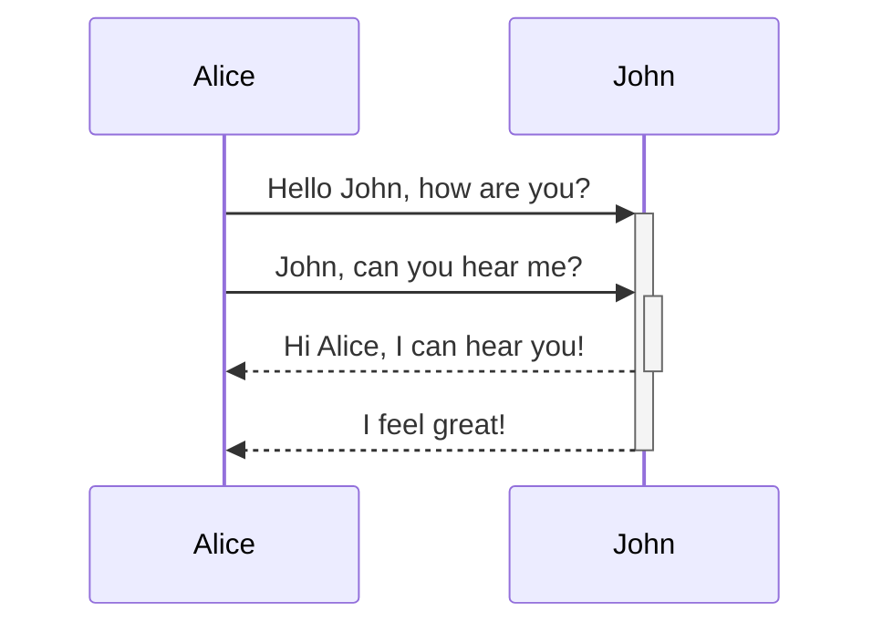

<!--MERMAID {width:100}-->

<!--MCONTENT {content: "sequenceDiagram<br/>\nAlice->>+John: Hello John, how are you?<br/>\nAlice->>+John: John, can you hear me?<br/>\nJohn\\-\\-\\>>-Alice: Hi Alice, I can hear you!<br/>\nJohn\\-\\-\\>>-Alice: I feel great!<br/>"} --->

<br/>

Este es el componente que se está usando para la sección de "Sobre mi". En este caso no tiene nada de especial, es un ejemplo de cómo podemos acceder al código fácilmente (teniéndolo siempre actualizado con los últimos cambios de nuestro repositorio) y documentarlo
<!-- NOTE-swimm-snippet: the lines below link your snippet to Swimm -->
### 📄 src/app/features/about-me/about-me.component.ts
```typescript
1      import { Component, OnInit } from '@angular/core';
2      
3      @Component({
4        selector: 'app-about-me',
5        templateUrl: './about-me.component.html',
6        styleUrls: ['./about-me.component.sass']
7      })
8      export class AboutMeComponent implements OnInit {
9      
10       constructor() { }
11     
12       ngOnInit(): void {
13       }
14     
15     }
16     
```

<br/>

This file was generated by Swimm. [Click here to view it in the app](https://app.swimm.io/repos/Z2l0aHViJTNBJTNBbWZlcm5hbmRlemdhcmNpYS5naXRodWIuaW8lM0ElM0FtZmVybmFuZGV6Z2FyY2lh/docs/puuus).
